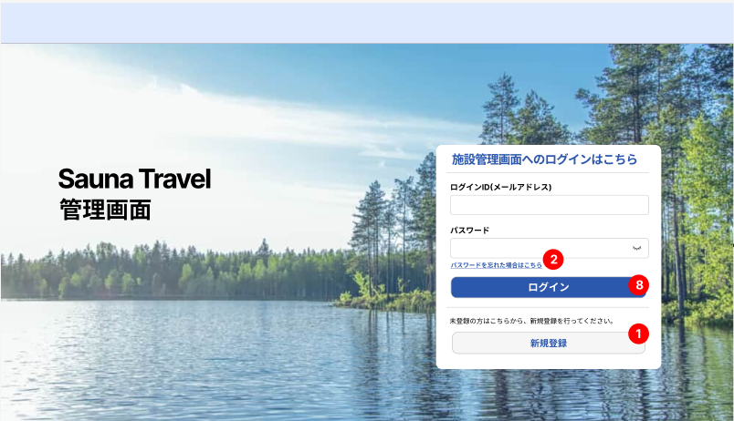

# 【サウナトラベル検索サイト】業務要件定義書_ログイン画面

Confidential SaunaTravel

|更新日|対応者|内容|
|-|-|-|
| 2024/09/09 | 立野 | 新規作成 |

***

## 目次
### [1.1 概要](#anchor1)
### [1.2 UIスケッチ](#anchor2)
### [1.3 ビジネスルール](#anchor3)

***

### 1.1 概要
サウナトラベル施設管理画面へのログイン

### 1.2 UIスケッチ

### 1.3 ビジネスルール

1. **ログインフォーム**
   - メールアドレスとパスワードを入力するフォームフィールド。  
   - ログインボタンの下には「パスワードを忘れた場合はこちら」リンクがあり、押下すると[5_パスワード再登録依頼画面]に遷移する。  
   - 「新規登録」ボタンが配置され、押下すると[2_新規登録画面]に遷移する。
       - メールアドレスとパスワードは必須項目。※バリデーションチェックのルールについては利用者側の画面と同様
       - 「ログイン」ボタンの押下で認証処理を行い、成功時は管理画面に遷移。
       - ログイン失敗時は、各入力フォーム下でエラーメッセージを表示する（例：「メールアドレスが間違っています」、「パスワードが間違っています」）。
       - パスワード入力時は「●●●」でマスク表示　※ただし入力欄右端の目マーク押下で表示
