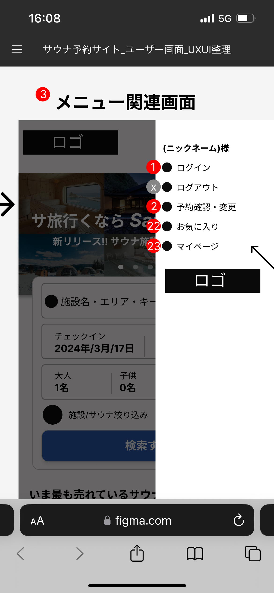

# 【サウナトラベル検索サイト】業務要件定義書\_トップ画面\_メニュー関連画面

Confidential SaunaTravel

|更新日|対応者|内容|
|-|-|-|
| 2024/08/12 | 原 | 新規作成 |

***

## 目次
#### [1 メニュー関連画面](#anchor1)

***

## 1 メニュー関連画面

### 1.1 概要

メニュー画面でユーザー情報に紐付く画面に遷移する

### 1.2 要件

#### 1.2.1 ビジネスルール

0. **メニュー全体**
   - メニュー画面以外を押下でメニューを閉じる

1. **ニックネーム**
   - ログインした場合ユーザーの登録したニックネームを表示する
   - ログイン時のみ表示する※

2. **ログイン　ボタン**
   - ログイン画面に遷移する
   - ログアウト時のみ表示する

3. **ログアウト　ボタン**
   - ログアウトする
   - ログイン時のみ表示する

4. **予約確認・変更　ボタン**
   - 予約確認画面に遷移する
   - ログイン時のみ表示する※

5. **お気に入り　ボタン**
   - お気に入り画面に遷移する
   - ログイン時のみ表示する※

6. **マイページ　ボタン**
   - マイページ画面に遷移する
   - ログイン時のみ表示する※

### 1.3 疑問点

- メニュー関連画面ではなくメニュー画面が適切？
- マイページではなく、ユーザー情報確認・更新が適切？
- ログインしているときとログアウトしているときで情報をだし分けするか？   
  - ログインしていないときは※の箇所は表示せずにログインのボタンのみ設けるか
  - ログインしていなくても※は設ける。※を押下するとログイン画面に
  遷移し、ログイン画面成功すれば該当の画面に遷移するようにするか
- ログアウトボタンは一番下に設ける方が良い気がする(優先度の
高い項目ではないため)
