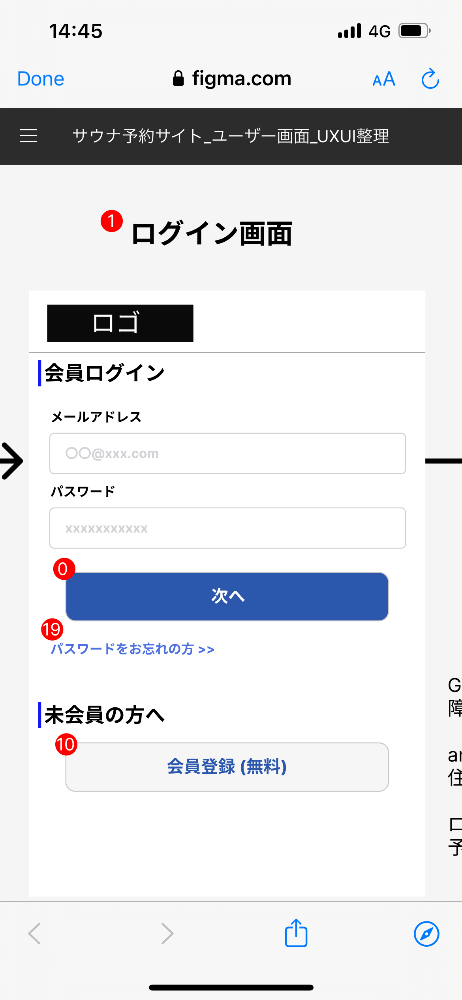

# 【サウナトラベル検索サイト】業務要件定義書\_トップ画面\_ログイン画面

Confidential SaunaTravel

|更新日|対応者|内容|
|-|-|-|
| 2024/08/12 | 原 | 新規作成 |
| 2024/08/17 | 原 | バリデーション引っかかった場合を追記 |

***

## 目次
#### [1 ユーザー情報入力](#anchor1)
#### [2 パスワード再設定](#anchor2)
#### [3 会員情報新規登録](#anchor3)

***

## 1 ユーザー情報入力

### 1.1 概要

ユーザー情報を入力してログインする

### 1.2 要件

#### 1.2.1 バリデーションチェック

| 入力項目 | 必須チェック                   | 文字数チェック   | 利用可能文字種チェック| 必要文字種チェック |  相関チェック | 一意性チェック | マスタチェック |
| ------ | ------------------------------ | --------------- | ------- | -------| ------- | ------- | ------- |
| メールアドレス入力ボックス  | 　必須   |  なし   | なし| なし| なし  | なし | 一致する物があるか照合する |
| パスワード入力ボックス  | 　必須   | なし  | なし | なし |なし | なし | 一致するか照合する |

#### 1.2.2 ビジネスルール

1. **メールアドレス入力ボックス**
   - ユーザーのメールアドレスを入力できる
   
2. **パスワード入力ボックス**
   - ユーザーのパスワードを入力できる

3. **次へボタン**
   - ボタンを押下すると、バリデーションチェックが実行される(下記の順番)
      -  入力ボックスが埋められているか
      - 文字種チェックの条件を満たしているか
      -  メールアドレスが存在するものか
      -  パスワードが一致するか
   - バリデーションにひっかかった場合
      - 該当箇所を赤枠で囲う
      - チェック理由を入力ボックス以下に表示する
      - パスワードのみ全部クリアする 
   -  ログイン情報が一致したらホーム画面に遷移する

### 1.3 疑問点

## 2 パスワード再設定

### 2.1 概要

パスワード再設定画面に遷移する

### 2.2 要件

#### 2.1.1 ビジネスルール

1. **パスワードをお忘れの方　ボタン**
   - ボタン押下でパスワード再設定画面に遷移する

## 3 パスワード再設定

### 3.1 概要

パスワード再設定画面に遷移する

### 3.2 要件

#### 3.1.1 ビジネスルール

1. **会員登録(無料)　ボタン**
   - ボタン押下で会員登録画面に遷移する
