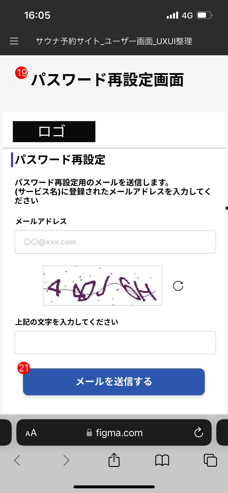

# 【サウナトラベル検索サイト】業務要件定義書\_トップ画面\_パスワード再設定画面

Confidential SaunaTravel

|更新日|対応者|内容|
|-|-|-|
| 2024/08/12 | 原 | 新規作成 |

***

## 目次
#### [1 パスワード再設定](#anchor1)

***

## 1 パスワード再設定

### 1.1 概要

メールアドレスを入力し、パスワードを再設定する

### 1.2 要件

#### 1.2.1 バリデーションチェック

| 入力項目 | 必須チェック                   | 文字数チェック   | 利用可能文字種チェック| 必要文字種チェック | 相関チェック | 一意性チェック | マスタチェック |
| ------ | ------------------------------ | --------------- | ------- | ------- | ------- | ------- |------- |
| メールアドレス入力ボックス  | 　必須   |  なし   | なし| なし | なし  | なし | 一致する物があるか照合する |
| CAPTCHA入力ボックス  | 　必須   | なし  | 半角英数字 | なし | なし | なし | なし |

#### 1.2.2 ビジネスルール

1. **メールアドレス入力ボックス**
   - ユーザーのメールアドレスを入力できる
   
2. **CAPTCHA入力ボックス**
   - CAPTCHAに表示される文字列を入力できる

3. **メールを送信する　ボタン**
   - ボタンを押下すると、バリデーションチェックが実行される(下記の順番)
      -  入力ボックスが埋められているか
      - 文字種チェックの条件を満たしているか
      -  メールアドレスが存在するものか
      -  CAPCTHAが一致するか
    - バリデーションチェックでCAPCTHAが一致しない場合にはCAPTCHA入力ボックスをクリアしてCAPTCHAを更新する
   -  メールアドレス、CAPCTHAが一致したらパスワード再設定画面に遷移する 

### 1.3 疑問点
