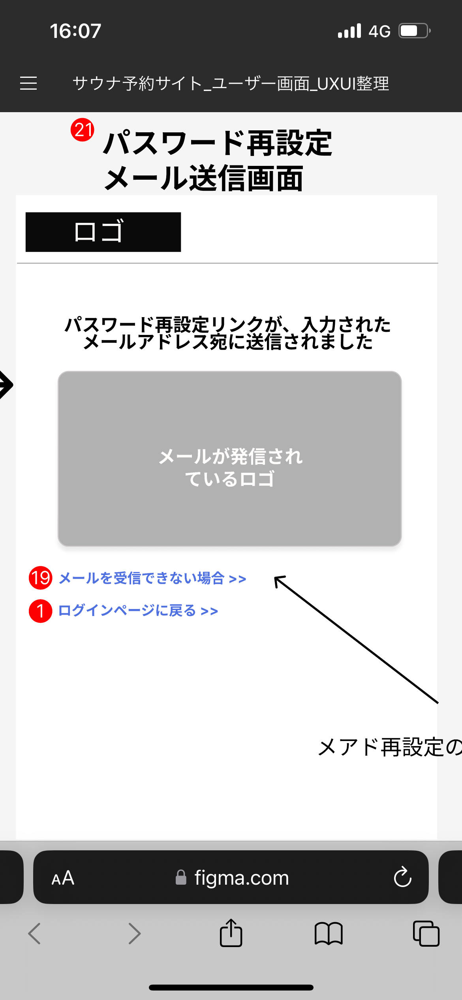

# 【サウナトラベル検索サイト】業務要件定義書\_トップ画面\_パスワード再設定メール送信画面

Confidential SaunaTravel

|更新日|対応者|内容|
|-|-|-|
| 2024/08/12 | 原 | 新規作成 |

***

## 目次
#### [1 メールを受信できない場合](#anchor1)
#### [2 ログインページに戻る](#anchor2)

***

## 1 メールを受信できない場合

### 1.1 概要

メールを受信できない場合、ユーザーのメールアドレス再設定を促す

### 1.2 要件

#### 1.2.1 ビジネスルール

1. **メールを受信できない場合　ボタン**
   - メールアドレス再設定画面に遷移する

### 1.3 疑問点

-メールを受信できない場合に、一般的には、迷惑メールになっていないかの確認を促す文言が記述されているのを見かけるが、メールアドレス再設定しか促さないのか？

## 2 ログインページに戻る

### 2.1 概要

パスワードの再設定が完了したユーザーにログイン画面の遷移を促す

### 2.2 要件

#### 2.2.1 ビジネスルール

1. **ログインページに戻る　ボタン**
   - ログイン画面に遷移する
