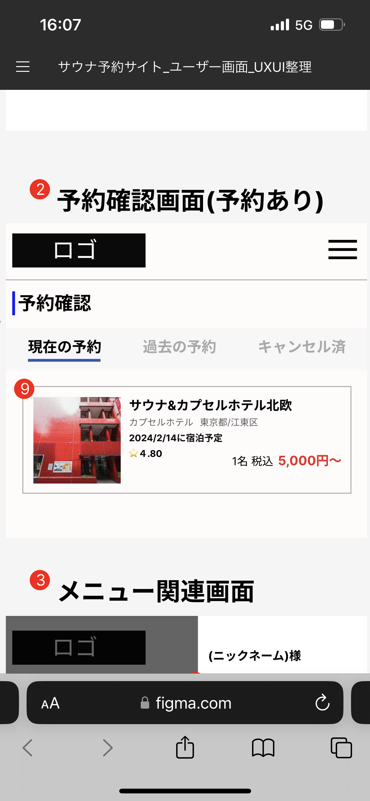

# 【サウナトラベル検索サイト】業務要件定義書\_トップ画面\_予約確認画面

Confidential SaunaTravel

|更新日|対応者|内容|
|-|-|-|
| 2024/08/12 | 原 | 新規作成 |

***

## 目次
#### [1 現在の予約一覧](#anchor1)
#### [2 過去の予約一覧](#anchor2)
#### [3 キャンセル済み一覧](#anchor3)

***

## 1 現在の予約一覧画面

### 1.1 概要

ユーザーに紐づく現在の予約情報を確認できる

### 1.2 要件

#### 1.2.1 ビジネスルール

1. **現在の予約**
   - 現在予約している施設をリスト形式で確認できる
   - 施設名、宿泊予定日、施設の住所、施設の評価、予約時の人数・値段が確認できる
   - 宿泊予定日が近い順に表示される
   - 施設を押下すると施設詳細画面に遷移する
   - 予約情報がない場合はサウナ施設を探すボタンを表示する
     - ボタンを押下でホーム画面に遷移する？

2. **過去の予約**
  - 過去の予約押下で過去の予約一覧画面にタブ移動する

3. **キャンセル済**
  - キャンセル済押下でキャンセル済一覧画面にタブ移動する
   
### 1.3 疑問点

- 人数・値段は予約時の情報に基づいて表示するで良いか？
- 住所はどこまで表示するか
- 男性専用などの文言は何を表示する予定か
  - 全量を把握したい
  - 何に基づき表示されるのか 
- 予約情報がない場合の遷移先は？

## 2 過去の予約一覧画面

### 2.1 概要

ユーザーに紐づく過去の予約情報を確認できる

### 2.2 要件

1. **現在の予約**
 - 現在の予約押下で現在の予約一覧画面にタブ移動する

2. **過去の予約**
   - 過去予約した施設をリスト形式で確認できる
   - 施設名、宿泊日、施設の住所、施設の評価、予約時の人数・値段が確認できる
   - 宿泊日が近い順に確認できる
   - 施設を押下すると施設詳細画面に遷移する
   - 予約情報がない場合はサウナ施設を探すボタンを表示する
     - ボタンを押下でホーム画面に遷移する？

3. **キャンセル済**
  - キャンセル済押下でキャンセル済一覧画面にタブ移動する

## 3 過去のキャンセル一覧画面

### 3.1 概要

ユーザーに紐づく過去のキャンセル情報を確認できる

### 3.2 要件

1. **現在の予約**
 - 現在の予約押下で現在の予約一覧画面にタブ移動する

2. **過去の予約**
  - 過去の予約押下で過去の予約一覧画面にタブ移動する

3. **キャンセル済**
   - 過去キャンセルした施設をリスト形式で確認できる
   - 施設名、キャンセル試行日、施設の住所、施設の評価、予約時の人数・値段が確認できる
   - キャンセル日が近い順に確認できる
   - 施設を押下すると施設詳細画面に遷移する
   - キャンセル情報がない場合はキャンセル情報はありません画面を表示する
   - (キャンセル情報はアーカイブする)

### 3.3 疑問点

- キャンセル情報は長期間残す必要があるか？
  - ある程度でアーカイブすれば良さそう 