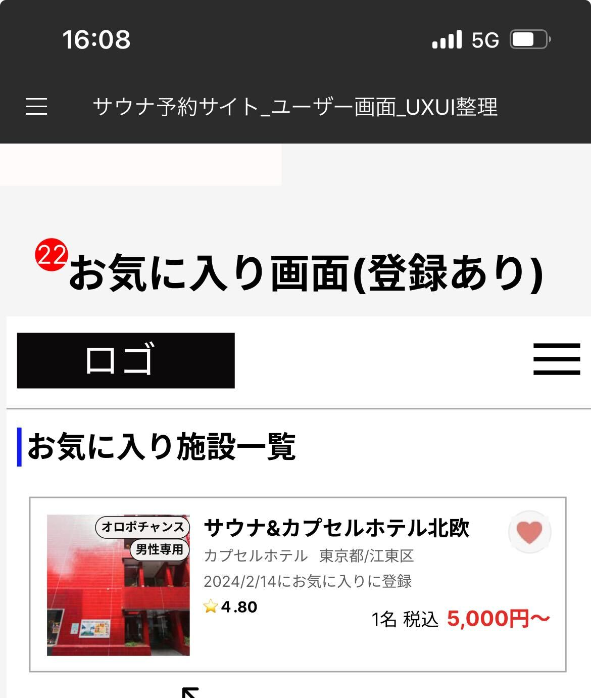

# 【サウナトラベル検索サイト】業務要件定義書\_トップ画面\_お気に入り画面

Confidential SaunaTravel

|更新日|対応者|内容|
|-|-|-|
| 2024/08/12 | 原 | 新規作成 |

***

## 目次
#### [1 お気に入り施設一覧](#anchor1)

***

## 1 お気に入り施設一覧

### 1.1 概要

ユーザーに紐づくお気に入り施設を確認できる

### 1.2 要件

#### 1.2.1 ビジネスルール

1. **お気に入り施設一覧**
   - 現在お気に入りに登録している施設をリスト形式で確認できる
   - 施設名、お気に入り登録日、施設の住所、施設の評価、施設の値段が確認できる
   - お気に入り日登録日が近い順に表示される
   - 施設を押下すると施設詳細画面に遷移する
   - お気に入り施設数が多いユーザーはページングで取得すること(20件ごと)
   - お気に入り用のハートのアイコンを用意する
    - アイコンを押下で登録/解除ができる

### 1.3 疑問点

- お気に入り登録日を表示する必要はあるか
- お気に入り登録数が多いユーザーはページングで良いか？また、20件ごとでよいか
- お気に入りを解除したら即座に画面から削除されるのか